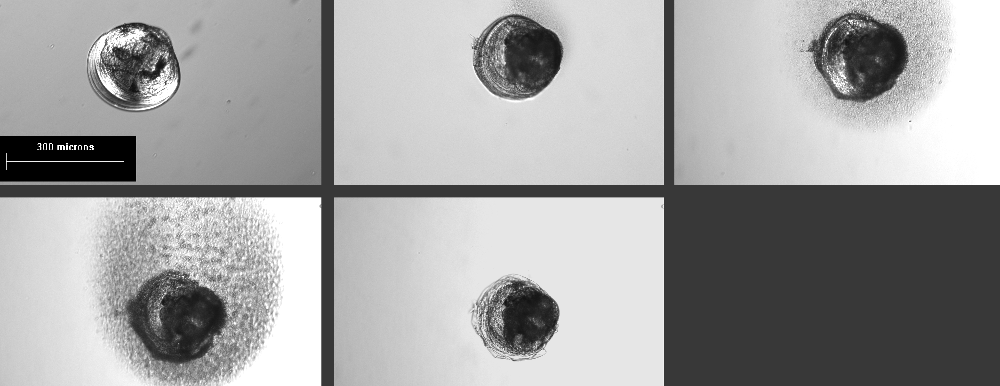

```{r child="./_styles.Rmd"}
```

# Generalized linear models: logistic regression



<h2 id="multi"> Introduction </h2>

This week in lab, we will start to take a closer look at generalized linear models (GLM) through the lens of logisitic regression using maximum likelihood estimation and Bayesian inference. This is a family that includes multiple types of analyses depending on the data. For example, we might have binary data (0, 1), binomial data (number of success per some number of trials), or multinomial data (group membership as a response). We will look at the simplest of these cases, binary logistic regression, this week in the homework.

## The data
For our exercise this week, we will work with a data set from a Biological Field Station intern project. The purpose of the project was to test the efficacy of Virkon as a molluscicide for dissinfecting equipment following exposure to zebra mussels *Dreissena polymorpha*. The study examined the effects of exposure time and concentration on mortality. The response in this data set is `dead`, a 1/0 variable indicating whether or not a zebra mussel was dead. Usually, with this kind of data, we use a `1` to indicate survival, but it seemed like too much fun to pass up the opportunity to model mortality as a success. So, for this data set a `1` indicates dead.

Start by reading in the data.

```{r}
vd <- read.csv("data/veligers.csv")
```

This data set contains a *pile* of variables, which of course makes it very fun to play with. We will work with some, but not all, of these variable this week for lab. 

Explanations of variables are as follows:

`Date`: calendar date for start of each lab test

`Location`: the location in Otsego Lake, NY from which mussels were collected

`SolnAge`: the age of the Virkon solution

`Concentration`: concentration of Virkon in solution

`Time`: exposure time

We will treat `Concentration` as a categorical variable because we only have a few different concentrations, although the argument could be made to treat it as a continuous variable.
```{r}
vd$Concentration <- as.factor(vd$Concentration)
```

The remaining variables are physical and chemical parameters of water measured either in Otsego Lake, or in the Virkon solution. 
 
## Exercises
<h3 id="multi"> A worked example </h3>
Let's start with a simple example to get you moving along. We are interested in determining the effects of `Concentration` and `Time` on the probability of zebra mussel death (`dead`) following exposure. If you have been following closely during the past few weeks, you will recognize that with a categorical variable (`Concentration`) and a continuous variable (`Time`) we are looking at something that should resemble ANCOVA to you. **But**, our response, `dead`, can only take on values of 0 and 1, so we know that we need to use a GLM to accommodate this.

 
#### Analysis
Start by fitting a model with additive effects of `Concentration` and `Time` on the response `dead` using either maximum likelihood estimation (`glm()` function in base R) or Bayesian estimation (`stan_glm()` function in `rstanarm`).

You could do it like this with the `glm()` function:

```{r}
# Fit the model
v_mod <- glm(dead ~ Concentration + Time, family = "binomial", data = vd)
```

Or you could fit it like this in the `rstanarm` package:

```{r, eval = FALSE, echo = TRUE}
# Library
library(rstanarm)

v_mod <- stan_glm(dead ~ Concentration + Time,
                  family = "binomial",
                  data = vd,
                  cores = 4
                  )
```

Cool, that was easy! 

#### Results
Let's have a look at what the model tells us about our biological questions of interest now. 

If you used `glm()` to fit the model: Remember, we need to work with the `Anova()` function in the `car` package to use the correct calculations because we have continuous and categorical variables. The only difference is that we are now using an analysis of deviance to summarize significance, which requires the use of a Type-II test instead of a Type-III test.

If you used `stan_glm()` to fit the model: Remember, Stan won't give you p-values or significance codes, so if you want to know whether groups are different, you need to do the math here and compare posteriors like we did in [Chapter 17.2](https://danstich.github.io/worst-r/17-2-logistic-17.html#interpretting-17).


**Question 1.** At the default confidence level ($\alpha$ = 0.05), what can you determine about effects of `Concentration` and `Time` with respect to statistical significance? Answer in sentence form, stating the null hypotheses and supporting statistics.

Just as with all of our other models, we can use the `summary()` function to get the output from R.
```{r}
# Print the summary of the model
summary(v_mod)
```

The summary of the model gives us the estimated coefficients **on the logit scale**, along with our usual significance codes and an AIC score (now in the default output because we are using maximum likelihood estimation).

Even though these parameters are on the logit scale, we can still make limited inference about the direction of relationships as we would with linear models used earlier in the semester. 

**Question 2.** What, if any, is the direction of the relationship between `Time` and zebra mussel mortality? 

**Question 3.** What is the general trend in mortality with the different concentrations listed in the `summary` of `vmod`? This may take a little thought, but remember that even as categorical variables, factor levels are listed alphanumerically in the output. If `Concentration == 0` ("control") is in the intercept, then the remaining coefficients are directly comparable.

<!-- Here, we see that the coefficient for `Time` is positive (`r round(v_mod$coefficients[7], 3)`), meaning that we would predict probability of `dead` to be directly proportional to `Time` (higher probability of death following increased exposure time). This, of course, seems perfectly reasonable. -->

One thing that you'll notice is missing from this output is the R^2^ value that we have become familiar with during the past several weeks while working with linear models. There is no R^2^ value because we are no longer estimating these models using ordinary least squares, but rather maximum likelihood estimation or Bayesian inference. 

Under Bayesian inference in the `rstanarm` package, we can just use the `bayes_R2()` function to get this.

If we wanted to get an analagous metric of variance explained by our model for the MLE fit using `glm()` output, we could estimate a *pseudo-R^2^*. There are many of these available depending on the model and nature of our data. The simplest, and arguably most common is the **McFadden R^2^**. To estimate this one, we compare the deviance of our model to the deviance of an intercept-only (i.e. "null") model using the output from the `summary` function above:

$$McFadden R^2 = 1 - \frac{Deviance_{residual}}{Deviance_{null}}$$

In R, the residual deviance is stored in `v_mod$deviance` and the null deviance is stored in `v_mod$null.deviance`.

<!-- Here, we can see that the model only explains about `r round(1-(v_mod$deviance/v_mod$null.deviance), 2)*100`% of the variation in the response of interest: -->

**Question 4.** How much of the variation in zebra mussel mortality is explained by the additive effects of `Concentration` and `Time`?

Now that we have a feel for just how much variability this model explains, the next step in reporting our results here is to extract some information about how `dead` changes with `Time` beyond simply stating that it was either "inversely" or "proportionally" related to `Time`. We will include `Concentration` in our predictions to account for changes between doses.
 
Recall that we can make predictions from our model either by hand or by using the `predict` function in R. **Note** that if we use the `predict()` function for `glm` or `stan_glm` objects in R, we no longer have the ability to set the `interval` argument as we did for objects resulting from the `lm()` function (well, we can - it will just be ignored). But, we can get standard error estimates if we make predictions on the link scale and specify `se.fit = TRUE`. Therefore, if we want confidence intervals on our predictions, we will need to do it by hand (well, in the computer).
 
Start by making some predictions. Recall from that this gets a little more complicated when we have multiple explanatory variables. The `predict` function requires a `data.frame` with `names` that match the `names` of explanatory variables from our original data set, `vd`.

```{r}
# Calculate mean predicted value and SE for the predictions
# on the link scale
logit_preds <- data.frame( predict(v_mod, type = "link", se.fit = TRUE) )

# Now get lower and upper CIs
logit_preds$lwr <- logit_preds$fit + logit_preds$se.fit * qnorm(0.025)
logit_preds$upr <- logit_preds$fit + logit_preds$se.fit * qnorm(0.975)
```

Now, we need to define a function to invert the logit link function if we want to get our predictions back on the probability scale (and we do). If you fit this model using `rstanarm` you can use the `invlogit()` function that ships with it.

```{r}
invlogit <- function(x) {
  exp(x) / (1 + exp(x))
}
```

Now we can convert our predictions to the probability scale. Here, we loop over columns 1, 3, and 4 of our `preds` dataframe using the `apply` function because the second column is just the standard errors for our predicted fit at each point. This gives us mean and 95% CI on the probability scale.

```{r}  
# Convert the predictions to the probability scale
real_preds <- apply(logit_preds, 2, invlogit)

# Add our predictions back to the original data
vd_preds <- data.frame(vd, real_preds)

```

Finally, let's plot our predictions. Note that here we will plot our raw data as the proportion of zebra mussels dead at a given time and concentration by trial (date). Here is my graph:

```{r, message=FALSE, warning=FALSE}
library(tidyverse)

# Summarize proportion dead at time by concentration
# Use dates so we can show reps
sum_points <- vd_preds %>%
  group_by(Concentration, Time, Date) %>%
  summarize(props = sum(dead)/length(dead))

# Plot the predictions
ggplot(vd_preds, aes(x = Time, y = fit)) +
  geom_ribbon(
    aes(ymin = lwr, ymax = upr, fill = Concentration), alpha = 0.25) +
  geom_line(aes(color = Concentration)) +
  geom_jitter(
    aes(x = Time, y = props, color = Concentration), data = sum_points,
    width = 1) +
  xlab("Hours") +
  ylab("Probability of mortality") +
  theme_bw() +
  theme(panel.grid = element_blank())

```

Using either the graph or the estimates in the `fit` column of `preds`, we can estimate about how much `dead` changes across the range of `Time` observed. We can report this by `Concentration` to convey more information. 

**Question 5.** Use the graph you have created, along with the model results to describe how zebra mussel mortality changed with `Concentration` and `Time` in paragraph form. Be sure to report the relevant test statistics along with your answer. This requires you to put together the info from each of the previous questions.


